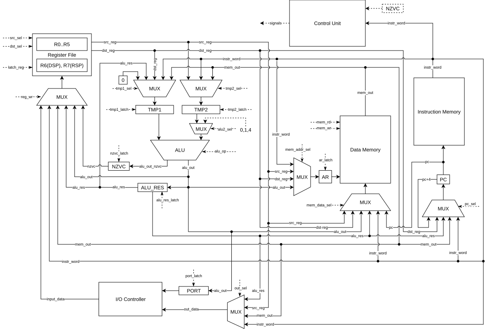
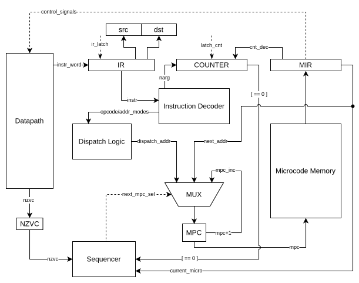
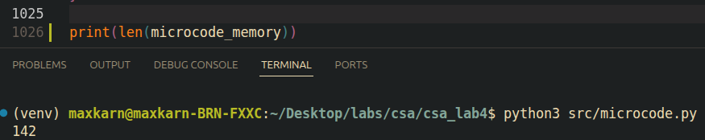

# CSA. Лабораторная работа №4

**Автор:** Карнажицкий Максим Романович (466127), P3211

**Вариант:** `forth | cisc | harv | mc | tick | binary | stream | port | pstr | prob1 |` ~~`cache`~~

---

# Содержание

1. [Язык программирования](#язык-программирования)
   1. [Синтаксис](#синтаксис)
   2. [Особенности языка](#особенности-языка)
2. [Организация памяти](#организация-памяти)
   1. [Память данных](#память-данных)
   2. [Память инструкций](#память-инструкций)
   3. [Память микрокоманд](#память-микрокоманд)
   4. [Регистры](#регистры)
3. [ISA](#isa)
   1. [Форматы инструкций](#форматы-инструкций)
   2. [Режимы адресации](#режимы-адресации)
   3. [Набор инструкций](#набор-инструкций)
4. [Транслятор](#транслятор)
   1. [Интерфейс командной строки](#интерфейс-командной-строки)
   2. [Этапы трансляции](#этапы-трансляции)
   3. [Ограничения и ошибки трансляции](#ограничения-и-ошибки-трансляции)
5. [Модель процессора](#модель-процессора)
   1. [Datapath](#datapath)
   2. [Control Unit](#control-unit)
   3. [Цикл исполнения инструкции](#цикл-исполнения-инструкции)
   4. [Микропрограммное управление](#микропрограммное-управление)
6. [Тестирование](#тестирование)
   1. [Список реализованных алгоритмов](#список-реализованных-алгоритмов)
7. [CI](#ci)

---

# Язык программирования

## Синтаксис

Forth-подобный язык, взаимодействующий с данными на стеке. Как следствие - поддерживает обратную польскую нотацию.

### BNF

```bnf
<program>       ::= <element> { <ws> <element> }

<element>       ::= <var_decl> | <word_def> | <statement>

<var_decl>      ::= "var" <ws> <identifier>

<word_def>      ::= ":" <ws> <identifier> <ws> <statement_seq> ";"

<statement_seq> ::= { <statement> <ws> }

<statement>     ::= <number>
                  | <string_literal>
                  | <immediate_string>
                  | <builtin>
                  | <if_stmt>
                  | <begin_until_stmt>
                  | <identifier>
                  | "'" <ws> <identifier>

<if_stmt>       ::= "if" <statement_seq> [ "else" <statement_seq> ] "endif"

<begin_until_stmt> ::= "begin" <statement_seq> "until"

<builtin>       ::= "!" | "@" | "@+" | "!+" | "execute"
                  | "dup" | "drop" | "swap" | "over"
                  | ">r" | "r>" | "r@"
                  | "+" | "-" | "*" | "/" | "mod"
                  | "=" | "<" | ">"
                  | "&" | "|" | "^" | "~"
                  | "d+" | "n+" | "n*"
                  | "." | "emit" | "key" | "nkey"
                  | "type" | "s." | "in" | "out"

<number>        ::= [ "-" ] <digit> { <digit> }

<immediate_string> ::= '."' <ws> <string_body> '"'
<string_literal>   ::= '"' <string_body> '"'
<string_body>      ::= { <string_char> | <escape_seq> }
<escape_seq>       ::= "\\" | '\"' | "\n" | "\t"
<string_char>      ::= <any character except '"' and '\'>

<identifier>    ::= <id_start> { <id_char> }
<id_start>      ::= <letter> | "_"
<id_char>       ::= <letter> | <digit> | "_" | "-" | "?"

<letter>        ::= "a"..."z" | "A"..."Z"
<digit>         ::= "0"..."9"

<ws>            ::= ( " " | "\t" | "\n" ) { " " | "\t" | "\n" }

<comment> ::= "(" { <any character except ")" > } ")" | '\' { <any character except '\n'> } '\n'
```

### Семантика и ключевые слова

Так как язык взаимодействует со стеком, то для описания состояния стека до и после применения определенной операции используется **стековая диаграмма**. Подробнее про эту нотацию описано в конце статьи [Fundamental Forth](https://www.forth.com/starting-forth/1-forth-stacks-dictionary/) - \[Ctrl+F\]("To communicate stack effects").

Далее будут использованы следующие сокращения:

> `TOS` (Top Of the Stack) - значение на вершине стека (обычно подразумевается стек данных). \
> `TODS` - Top of Data Stack, `TORS` - Top of Return Stack \
> `NOS` (Next On the Stack) - значение второго элемента стека \
> `DSP` (Data Stack Pointer) - указатель на верхний элемент стека данных в памяти \
> `RSP` (Return Stack Pointer) - указатель на верхний элемент стека возврата в памяти

#### Variables & Memory

| Операция | Стековая диаграмма | Описание |
|-|-|-|
| `var <var_name>` | `( -- )` | Выделяет машинное слово 32 бит в памяти данных. Адрес подставляется как Immediate-значение на этапе трансляции |
| `var <var_name> N allot` | `( -- )` | Выделяет машинное слово под переменную + N слов далее (allocate, полезен для динамической записи строк/массивов) | 
| `<var_name>` | `( -- addr )` | Кладет адрес объявленной переменной на стек |
 `"str"` | `( -- pstr_addr )` | Создание `pstr` в памяти, на стек ложится её адрес |
| `!` | `( val addr -- )` | Запись `val` по адресу `addr` |
| `@` | `( addr -- val )` | Чтение значения по адресу `addr` на стек |

#### Stack handling

| Операция | Стековая диаграмма | Описание |
|-|-|-|
| `drop` | `( a -- )` | Удаляет верхний элемент стека |
| `swap` | `( a b -- b a )` | Меняет местами `TOS` и `NOS` |
| `over` | `( a b -- a b a)` | Копирует `NOS` на место нового `TOS` |
| `>r`| `data: ( x -- ), return: ( -- x)` | Перемещение `TODS` -> `TORS` |
| `r>` | `data: ( -- x ), return: ( x -- )` | Перемещение `TORS` -> `TODS` |
| `r@` | `data: ( -- x ), return: ( x -- x )` | Дублировать элемент `TORS` в `TODS` |

#### Arithmetics

| Операция | Стековая диаграмма | Описание |
|-|-|-|
| `+`, `-`, `*`, `/`, `mod` | `( a b -- res )` | Классические операции, оперируют с двумя числами на стеке. `NOS <op> TOS -> TOS` |
| `=`, `<`, `>` | `( a b -- flag )` | Сравнение, результат `1` (true) или `0` (false) на стек |
| `n+`, `n*` | `( a_1 a_2 ... a_n N -- res )` | Аналог `+`/`*` для `N` аргументов. Транслируется в CISC команду `NADD`/`NMUL`. Операнды должны быть Immediate |
| `d+` | `( al ah bl bh -- rl rh )` | Сложение больших (64-битных) чисел |

#### Logics

| Операция | Стековая диаграмма | Описание |
|-|-|-|
| `&`, `\|`, `^` | `( a b -- res )` | Побитовые операции AND, OR, XOR. |
| `~` | `( a -- res )` | Побитовое отрицание NOT |

#### Control flow

| Операция | Стековая диаграмма | Описание |
|-|-|-|
| `<flag> if`, `else`, `endif` | `( flag -- )` | Условное выполнение: заход в `if`, если `flag == 1`, иначе - переход на адрес `endif` |
| `begin`, `<flag> until` | `( flag -- )` | Цикл DO-WHILE. Если `flag == 0`, прыгает обратно на `begin` |

#### Subroutines

| Операция | Стековая диаграмма | Описание |
|-|-|-|
| `: <f_name>` | `( -- )` | Начало объявления функции |
| `;` | `( -- )` | Конец объявления функции (транслируется в `RET`) |
| `' <f_name>` | `( -- addr )` | Получить execution token (адрес функции `f_name`) и положить его на стек |
| `execute` | `( addr -- )` | Вызвать подпрограмму по адресу с вершины стека |
| `<f_name>` | `( -- )` | Выполнить функцию с именем `f_name` |

#### I/O

Реализован **Port-mapped I/O**. Используются следующие порты:
* `port: 0` - Числовой вывод
* `port: 1` - Числовой ввод
* `port: 2` - Символьный (ASCII) вывод
* `port: 3` - Символьный ввод

| Операция | Стековая диаграмма | Описание | Используемый порт |
|-|-|-|-|
| `.` | `( number -- )` | Вывод числа с вершины стека | 0 |
| `emit` | `( char -- )` | Вывод символа с вершины стека | 2 |
| `key` | `( -- char )` | Чтение символа из порта в вершину стека | 3 |
| `nkey` | `( -- number )` | Чтение числа из порта в вершину стека | 1 |
| `." str"` | `( -- )` | Создание строки и её мгновенная печать в консоль без сохранения в памяти. **Важно:** необходимо ставить пробел после токена `."` | 2 |
| `type` / `s.` | `( pstr_addr -- )` | Вывод `pstr` **по адресу** из TOS (посимвольно) | 2 |
| `in` | `( port -- data )` | Чтение из заданного порта на вершину стека | *определяется аргуентом* |
| `out` | `( data port -- )` | Вывод значения `TOS` в заданный порт | *определяется аргументом* |

#### Comments

Комментарии бывают двух типов, и все они игнорируются при трансляции программы:

* `( some chars excepting ')' )` - многострочный комментарий внутри скобок
* `\ some text` - однострочный комментарий от `\` до конца текущей строки

## Особенности языка

> Для корректной работы программы токены (ключевые слова) **необходимо** разделять пробелами/табуляцией/новой строкой, так как транслятор разделяет строку по `whitespace`-символам.

Язык является **стековым**, поэтому все операнды должны находиться на стеке. Строковые и числовые литералы помещаются на **вершину стека** - арифметические и логические операции взаимодействуют только с ним, помещая результат также на стек.

Следствие работы со стеком - постфиксная нотация операторов. Если мы хотим написать `6 + 7`, то должны сначала поместить 2 операнда на стек данных, и только затем выполнить операцию. `6 7 +`.

Язык поддерживает **процедуры** (так называемые *слова*) - именованная последовательность операций, которая может быть выполнена при обращении по имени. Объявление происходит с помощью конструкции:
```forth
: F_NAME ... ;
```
При объявлении на этапе трансляции слово добавляется в словарь и становится доступным для обращения к нему по имени. Когда мы обращаемся к любому слову, адрес возврата (текущая позиция в памяти команд) кладется в *Return Stack*.

Конструкции *Control flow* также используют данные на вершине стека. Например, `if (1 > 2) { func1() } else { func2() } ` следует писать так: 
```forth
1 2 > if    \ флаг сравнения (результат) кладется на вершину стека - if проверяет его
    func1   \ flag == 1 - выполняем слово func1
else        
    func2   \ flag == 0 - выполняем слово func2
endif       \ завершение ветвления
```

Циклы действуют аналогично. Реализован аналог do-while. Например, код `do { smth() } while (3 > 1)` имеет вид:
```forth
begin           \ начало цикла
    smth        \ какие-то действия
3 1 > until     \ условие выхода - флаг на вершине стека. 
                \ flag == 0 -> выходим из цикла
                \ flag == 1 -> прыгаем на предыдущий begin
```

> *Поддерживаются вложенные комбинации Control flow*

Табуляции необязательны, допускается написание программ в 1 строку. Для читабельности **рекомендуется** осмысленно разделять на строки и использовать табуляцию.

### Строки

Использование литерала `"str"` кладет в статическую память *Pascal*-строку, то есть в первом слове размер строки, а далее сами символы.

Для того, чтобы записать строку в переменную `a` можно использовать следующий подход:
```forth
var a               \ выделяем память для переменной a
"some string"       \ создаем в статической памяти "some_string"; TOS = addr("some string")
a !                 \ получаем адрес переменной "a" и пишем в нее адрес строки в памяти
```

Для вывода строк можно использовать различные встроенные функции, описанные ранее в разделе *I/O*. **Рекомендуется** использовать `type` / `s.` (это одна и та же функция), так как они выводят целую строку по адресу, который, например, можно положить в переменную. Другие функции для вывода символов печатают *значение* из стека.

Пример (с предыдущей строкой `a`):
```forth
a @ type            \ получаем значение переменной a (ссылку на строку) и выводим целую строку
```

### Типизация

**Слабая динамическа типизация**

- Переменные не привязаны к типу и могут менять его в рантайме. 
- Как таковой тип переменных нигде не хранится

### Область видимости

**Глобальная область видимости** для всех переменных.

- Имена **всех переменных** хранятся в общем пространстве имен, и после объявления новой переменной она доступна **в любом месте** программы после объявления. 
- При переопределении переменной прошлое значение затирается новым.

---

# Организация памяти

**Гарвардская архитектура** - память данных и память команд находятся в независимых адресных пространствах.

## Память данных

- **Машинное слово** - 32 бита
- **Адресация** - байтовая (`AR` хранит байтовый адрес)
- **Режимы адресации** - см. [Режимы адресации в ISA](#режимы-адресации)

Память данных делится на три зоны:
- `return_stack` - **стек возврата** - *растет вверх* от нулевого адреса
- `static_data` - **статичеаксие данные** о переменных, их значениях и строках
- `data_stack` - **стек данных**, с которым оперируют операнды forth. *Растет вниз* от конца памяти.

```
        Data Memory
0x0 ----+-------------------------+
        |↓↓  return_stack         |
        |    ...                  |
0x200 --+-------------------------+
        |↓↓  static_data          |
        |    ...                  |
0xN ----+-------------------------+
        |    ...                  |
        |↑↑  data_stack           |
        +-------------------------+
```

### Работа с памятью данных

- **Строковые литералы** хранятся в памяти в виде `pstr`. Один символ на одно слово (32 бит).
- **Числовые значения** в коде загружаются в `data stack` как Immediate-значения
- **Значения перменных** хранятся в статической памяти, на этапе трансляции их адреса превращаются в Immediate-значения (берутся из словаря)


## Память инструкций

- **Машинное слово** - 32 бита
- **Адресация** - байтовая (`PC` хранит байтовый адрес)
- Инструкции переменной длины

```
        Instruction Memory
0x0 ----+-------------------------+
        |   instr_1               |
0x4 ----+-------------------------+
        |   instr_2               |
0x8 ----+-------------------------+
        |   #imm_operand          |
        +-------------------------+
        |   ...                   |
0xN ----+-------------------------+
        |   HALT_instruction      |
        +-------------------------+
        |   ...                   |
        +-------------------------+
```

## Память микрокоманд

Память микрокоманд располагается в `Control Unit`. Адресация - **пословная** (64 бит - размер микрокоманды). `MPC` - регистр адреса текущей микрокоманды - содержит номер слова в памяти микрокоманд.

## Регистры

### Общего назначения

8 регистров, с которыми можно напрямую оперировать через ISA.

> **Назначение регистра** - это то, какую роль регистр выполняет в контексте трансляции программы

| Регистр | Назначение |
|---------|------|
| `R0/TOS` | Вершина стека данных. Основной рабочий регистр для арифметики, логики, сравнений, адресов и I/O. Большинство forth-операций работают через R0 |
| `R1` | Временный регистр (`NOS`). Используется как второй регистр для бинарных операций на стеке. |
| `R2` | Вспомогательный регистр для расширенной арифметики. Используется в `d+` как **старшая часть первого** 64-битного операнда |
| `R3` | Вспомогательный регистр для расширенной арифметики. Используется в `d+` как **младшая часть первого** 64-битного операнда |
| `R4` | Итератор. Используется для вывода строк `type`/`s.` в качестве счетчика длины |
| `R5` | Не используется - зарезервирован для будущих расширений (или оптимизации транслятора...)
| `R6/DSP` | Указатель **data stack** - указывает на второй элемент на стеке (после `R0`). Активно используется в комбинации с `PRE_DEC` и `POST_INC` адресацией. **data stack растет вниз по памяти** |
| `R7/RSP` | Указатель **return stack**. Используется для адресов возврата (`JSR`/`RET` в качестве stack pointer), а также в самом forth (`r>`, `>r`, `r@`) |

---

# ISA


## Форматы инструкций

- Команды в системе переменной длины от 4 до N байт. Базовое слово - 4 байта. `Little-Endian`
- В зависимости от режимов адресации к нему добавляются 32-битные слова immediate-аргументов.

### Стандартный формат

```
31        27         23        19         15               7                0
+---------+----------+---------+----------+----------------+----------------+
| dst_val | dst_mode | src_val | src_mode |    reserve     |     opcode     |
+---------+----------+---------+----------+----------------+----------------+
```

| Поле       | Биты    | Описание                                          |
|------------|---------|---------------------------------------------------|
| `opcode`   | [7:0]   | Код операции                                      |
| `reserve`  | [15:8]  | Зарезервировано (n-арные: количество аргументов)  |
| `src_mode` | [19:16] | Режим адресации источника                         |
| `src_val`  | [23:20] | Номер регистра источника                          |
| `dst_mode` | [27:24] | Режим адресации назначения                        |
| `dst_val`  | [31:28] | Номер регистра назначения                         |

Если операнд - **Immediate**, следующее 32-битное слово содержит его значение.
При двух Immediate-операндах инструкция занимает 12 байт:
```
+-------------+ +---------------+ +---------------+
| base word   | | #imm_src (4B) | | #imm_dst (4B) |
+-------------+ +---------------+ +---------------+
```

### Формат N-арных команд

Поле `reserve` содержит количество аргументов N. Далее идут N immediate-слов по 4 байта:
```
+---------------------------+  +-----------+         +-----------+
| opcode | reserve=N | ...  |  | #imm_1    |   ...   | #imm_N    |
+---------------------------+  +-----------+         +-----------+
```

## Режимы адресации

| Режим               | Синтаксис | Код | Описание                          |
|---------------------|-----------|-----|-----------------------------------|
| Register Direct     | `Rn`      | 0   | Значение из регистра              |
| Register Indirect   | `(Rn)`    | 1   | Значение из памяти по адресу в Rn |
| Post-Increment      | `(Rn)+`   | 2   | Косвенная, затем `Rn += 4`        |
| Pre-Decrement       | `-(Rn)`   | 3   | `Rn -= 4`, затем косвенная        |
| Immediate           | `#n`      | 4   | Константа следующим словом        |

> Post-increment и Pre-decrement работают в масштабах машинного слова - шаг **4 байта**.

> [!NOTE]
> Архитектурная особенность: **нет ограничений на комбинации режимов адресации**.
> Любой опкод может использовать любой режим как для `src`, так и для `dst`.
> Все комбинации обрабатываются на микропрограммном уровне единообразно через таблицы диспетчеризации. **Наиболее частовстречаемые комбинации оптимизированы**. Подробнее - в разделе [Цикл исполнения инструкции](#цикл-исполнения-инструкции)


## Набор инструкций

| Мнемоника | Opcode | Аргументы | Описание               | Такты |
|-----------|--------|-----------|------------------------|-------|
| `MOVE`    | 0x00   | src, dst  | `dst <- src`; set NZVC | 2-7   |
| `CLR`     | 0x01   | dst       | `dst <- 0`; set NZVC    | 2-7   |
| `NEG`     | 0x02   | dst       | `dst <- -dst`; set NZVC | 2-7   |
| `ADD`     | 0x03   | src, dst  | `dst + src`; set NZVC               | 2-8   |
| `ADC`     | 0x04   | src, dst  | `dst + src + C`; set NZVC           | 2-8   |
| `SUB`     | 0x05   | src, dst  | `dst - src`; set NZVC               | 2-8   |
| `SBC`     | 0x06   | src, dst  | `dst - src - C`; set NZVC           | 2-8   |
| `MUL`     | 0x07   | src, dst  | `dst * src`; set NZVC    | 2-8   |
| `DIV`     | 0x08   | src, dst  | `dst / src`; set NZVC    | 2-8   |
| `REM`     | 0x09   | src, dst  | `dst mod src`; set NZVC  | 2-8   |
| `CMP`     | 0x0A   | src, dst  | `dst - src`; set NZVC | 2-7   |
| `NOT`     | 0x0D   | dst       | `dst <- ~dst`; set NZVC   | 2-7   |
| `AND`     | 0x0E   | src, dst  | `dst <- dst & src`        | 2-8   |
| `OR`      | 0x0F   | src, dst  | `dst <- dst \| src`       | 2-8   |
| `XOR`     | 0x10   | src, dst  | `dst <- dst ^ src`        | 2-8   |
| `ASL`     | 0x11   | src, dst  | Арифметический сдвиг влево             | 2-8   |
| `ASR`     | 0x12   | src, dst  | Арифметический сдвиг вправо | 2-8   |
| `LSL`     | 0x13   | src, dst  | Логический сдвиг влево                 | 2-8   |
| `LSR`     | 0x14   | src, dst  | Логический сдвиг вправо  | 2-8   |
| `NADD #a1, #a2, …, #an`        | 0x0B   | - | `R0 <- a1_ + a2 + … + an`        | 2 + 3*N     |
| `NMUL #a1, #a2, …, #an`        | 0x0C   | - | `R0 <- a1 * a2 * … * an`        | 2 + 3*N     |
| `JMP`     | 0x15   | src       | `PC <- src`                            | 2-6   |
| `BCC`     | 0x16   | src       | `if C=0: PC <- src`                    | 2-7   |
| `BCS`     | 0x17   | src       | `if C=1: PC <- src`                    | 2-7   |
| `BEQ`     | 0x18   | src       | `if Z=1: PC <- src`                    | 2-7   |
| `BNE`     | 0x19   | src       | `if Z=0: PC <- src`                    | 2-7   |
| `BLT`     | 0x1A   | src       | `if N≠V: PC <- src`                    | 2-7   |
| `BGT`     | 0x1B   | src       | `if Z=0 and N=V: PC <- src`            | 2-7   |
| `BLE`     | 0x1C   | src       | `if Z=1 or N≠V: PC <- src`             | 2-7   |
| `BGE`     | 0x1D   | src       | `if N=V: PC <- src`                    | 2-7   |
| `BMI`     | 0x1E   | src       | `if N=1: PC <- src`                    | 2-7   |
| `BPL`     | 0x1F   | src       | `if N=0: PC <- src`                    | 2-7   |
| `BVC`     | 0x20   | src       | `if V=0: PC <- src`                    | 2-7   |
| `BVS`     | 0x21   | src       | `if V=1: PC <- src`                    | 2-7   |
| `JSR`     | 0x22   | src       | Push PC -> RSP, `PC <- src`             | 2-7   |
| `RET`     | 0x23   | -         | Pop RSP -> PC                           | 3     |
| `HALT`    | 0x24   | -         | Останов                                | 2     |
| `IN`      | 0x25   | port, dst  | `dst ← IN[port]`      | 4-8   |
| `OUT`     | 0x26   | src, port  | `OUT[port] ← src`     | 4-8   |

Флаги обновляются всеми арифметическими, логическими и операциями сдвига.
`CMP` обновляет только флаги, не записывая результат.
Инструкции управления потоком и компоненты Control Unit читают флаги, но не изменяют их.

---

# Транслятор

Транслятор реализован в файле `translator.py` и преобразует программу на Forth-подобном языке
в бинарный машинный код для CISC-процессора.

## Интерфейс командной строки

```bash
python translator.py [--listing ] [--data ]
```

| Аргумент | Обязательный | Описание |
|----------|--------------|----------|
| `source` | да | Путь к файлу с исходным кодом (`.fth`) |
| `output` | да | Путь к выходному бинарному файлу с кодом инструкций |
| `--listing <file>` | нет | Путь к файлу листинга в человекочитаемом формате |
| `--data <file>` | нет | Путь к бинарному файлу статической памяти данных |

**Пример:**
```bash
python translator.py programs/hello.fth out/hello.bin \
    --listing out/hello.lst \
    --data out/hello.data
```

## Этапы трансляции

Трансляция **однопроходная** - программа читается линейно слева направо без построения
синтаксического дерева. Это возможно благодаря постфиксной природе Forth.

### 1. Токенизация

Исходный текст разбивается на токены:

- Удаляются однострочные и многострочные комментарии
- Строка разбивается по пробельным символам (пробел, табуляция, перенос строки)
- Строковые литералы `"..."` и `." ..."` сохраняются как единый токен
- Все токены кроме строковых литералов приводятся к нижнему регистру

Каждый токен обрабатывается в соответствии со своим типом:

- **Числовые литералы** - транслируются в два CISC-инструкции: push текущего TOS на стек
данных, затем загрузка константы в R0:
```
5  ->  MOVE R0, -(DSP)
       MOVE #5, R0
```

- **Переменные** - объявление `var x` выделяет 4 байта в статической памяти данных
начиная с адреса `0x200`. Обращение к имени переменной генерирует push её адреса на стек

- **Арифметические и логические операции** - pop второго операнда в `R1`, выполнение
операции, результат остаётся в R0:
```
+  ->  MOVE (DSP)+, R1
       ADD R1, R0
```

> [!NOTE]
> Некоммутативные операции (`-`, `/`, `mod`) дополнительно перекладывают результат обратно в `R0` через `MOVE`.

- **Строковые литералы** - `"str"` размещает Pascal-строку в статической памяти
(4 байта на длину + 4 байта на каждый символ), на стек кладётся адрес строки.
`." str"` дополнительно генерирует инлайн-цикл вывода строки посимвольно через `OUT` без обращений к памяти.

- **Control flow** - реализован через однопроходный алгоритм с использованием стека адресов
(`control_flow_stack`):
  - `if` - генерирует `BEQ #0` с незаполненным адресом, кладёт ссылку на инструкцию в стек
  - `else` - генерирует `JMP #0`, патчит адрес предыдущего `BEQ` на текущую позицию
  - `endif` - патчит адрес `BEQ` или `JMP` на текущую позицию
  - `begin` - запоминает текущий адрес в стеке
  - `until` - генерирует `BEQ #begin_addr`

- **Подпрограммы** - `:` записывает текущий адрес инструкции в словарь функций.
Обращение по имени генерирует `JSR #addr`. `;` генерирует `RET`.

- **N-арные операции** (`n+`, `n*`) - транслируются не вперёд, а *назад*: транслятор
извлекает из уже сгенерированных инструкций N предшествующих числовых аргументов
и N, формируя одну CISC-инструкцию `NADD`/`NMUL`:
```
1 2 3 3 n+  ->  NADD #1, #2, #3
```

### 3. Генерация выходных файлов

После трансляции всех токенов:

- Каждая инструкция сериализуется в бинарный код Little-Endian
- Бинарные слова конкатенируются в выходной файл инструкций
- Статическая память данных сохраняется в отдельный файл (если указан `--data`)

## Ограничения и ошибки трансляции

Транслятор завершается с ошибкой в следующих случаях:

| Ситуация | Сообщение |
|----------|-----------|
| Файл с исходным кодом не найден | `Error: source file '...' not found` |
| `else` без предшествующего `if` | `else without matching if` |
| `endif` без предшествующего `if`/`else` | `endif without matching if/else` |
| `until` без предшествующего `begin` | `until without matching begin` |
| `n+`/`n*` без предшествующего числового литерала N | `Expected immediate value for N before n+` |
| Аргументы `n+`/`n*` не являются числовыми литералами | `Only immediate values are supported for n+ arguments` |
| `'` (execution token) для неизвестной функции | `Unknown subroutine '...' for execution token` |
| Общая ошибка трансляции | `Translation error: ...` |

---

# Модель процессора

- `datapath.py` - Datapath. Шины вынесены в `@property` для более наглядной работы (это марионетки...)
- `control_unit.py` - Control Unit. Отвечает за декодирование инструкций, выполнение тактов (`tick`), вычисление следующего адреса в микропрограммной памяти, и в целом обеспечивает выполнение микрокоманд (это нитки марионетки...)
- `microcode.py` - Microcode Memory. В этот файл вынесено заполнение всей **микропамяти**, **таблиц диспетчеризации** (а это тот кто дергает за нитки...)

## Datapath



### I/O Controller

Контроллер ввода-вывода реализует port-mapped I/O. Имеет два входа:
- `port` - номер порта (защелкивается из `alu_out` через `port_latch`)
- `data` - значение для записи (через `OutMux`)

При чтении возвращает значение на линию `input_data`. При записи помещает значение в `output_buffer` (реализовано на уровне Python)

### Внутренние регистры
Эти регистры **недоступны программисту на уровне ISA**

| Регистр | Назначение |
|---------|------|
| `PC` | Байтовый адрес текущей исполняемой инструкции в *Instruction Memory* |
| `AR` | Байтовый адрес для доступа к `Data Memory` |
| `TMP1`, `TMP2` | Регистры перед левой и правой ногой ALU соответственно. Буферы для сохранения первого и второго операнда исполняемой команды |
| `ALU_RES` | Регистр для сохранения результата ALU | 
| `NZVC` | Флаги процессора, которые выставляются после выполнения операций ALU | 
| `PORT` | Защелка номера порта ввода-вывода | 

### Общее описание

- Все линии на схеме - **32-битные**
- `Register File` - содержит регистры общего назначения `R0`-`R7`. С помощью селекторов (по факту это мультиплексоры) `src_sel` и `dst_sel` выбираются регистры, значение которых поступает на линии `src_reg` и `dst_reg` соответственно. Для записи используется `RegWrMux`.
- `ALU` имеет 2 выхода - для значения и флагов. Чтобы обновить флаги после операции необходимо защелкнуть `nzvc_latch`. Это полезно, когда нам нужно просто пропустить значение через ALU, не потеряв флаги значений для следующей операции.

### Мультиплексоры

**`RegWrMux`** - выбор источника для записи в регистровый файл. Управляющий сигнал: `reg_wr_sel`.
- `INPUT_DATA` - данные с I/O контроллера
- `MEM_OUT` - данные из памяти данных
- `ALU_RES` - результат ALU
- `NZVC` - флаги процессора
- `INSTR_WORD` - слово из памяти инструкций
- `ALU_OUT` - выход ALU (до защелки ALU_RES)

**`Tmp1Mux`** - выбор значения для TMP1 (левая нога ALU). Управляющий сигнал: `tmp1_sel`.
- `ALU_RES` - результат предыдущей операции ALU
- `DST_REG` - значение целевого регистра
- `INSTR_WORD` - immediate-операнд из инструкции
- `MEM_OUT` - значение из памяти данных
- `ZERO` - константа 0

**`Tmp2Mux`** - выбор значения для TMP2 (правая нога ALU). Управляющий сигнал: `tmp2_sel`.
- `SRC_REG` - значение исходного регистра
- `INSTR_WORD` - immediate-операнд из инструкции
- `MEM_OUT` - значение из памяти данных

**`AluRightMux`** - выбор правого операнда ALU. Управляющий сигнал: `alu_right_sel`.
- `TMP2` - значение регистра TMP2
- `ZERO` - константа 0
- `ONE` - константа 1
- `FOUR` - константа 4

**`MemAddrMux`** - выбор адреса для AR. Управляющий сигнал: `mem_addr_sel`.
- `INSTR_WORD` - адрес из immediate-поля инструкции
- `SRC_REG` - значение исходного регистра
- `DST_REG` - значение целевого регистра
- `ALU_OUT` - результат ALU (используется для pre-dec/post-inc адресации)

**`MemDataMux`** - выбор данных для записи в память. Управляющий сигнал: `mem_data_sel`.
- `SRC_REG` - исходный регистр
- `DST_REG` - целевой регистр
- `ALU_OUT` - выход ALU
- `ALU_RES` - результат ALU
- `INSTR_WORD` - слово инструкции
- `PC` - текущий счетчик команд (используется в JSR для сохранения адреса возврата)

**`PcMux`** - выбор нового значения PC. Управляющий сигнал: `pc_sel`.
- `PC_INC` - PC + 4 (следующая инструкция)
- `DST_REG` - значение регистра (косвенный переход)
- `MEM_OUT` - значение из памяти (RET)
- `INSTR_WORD` - immediate-адрес (прямой переход)
- `ALU_RES` - результат ALU

**`OutMux`** - выбор данных для вывода в I/O. Управляющий сигнал: `out_sel`.
- `SRC_REG` - исходный регистр
- `MEM_OUT` - данные из памяти
- `INSTR_WORD` - immediate-значение
- `ALU_RES` - результат ALU


## Control Unit



### Внутренние регистры

| Регистр | Назначение |
|---------|------|
| `IR` | Instruction Register для сохранения текущей исполняемой инструкции. Используется для извлечения данных об адресации операндов и самих операндов декодером | 
| `MIR` | Текущая микрокоманда, исполняемая на данном такте. Отсюда через слой декодеров идут сигналы на схему |
| `MPC` | Microprogram Counter - указатель на текущую исполняемую микрокоманду в памяти микрокоманд | 
| `Counter` | Внутренний регистр-счетчик для исполнения n-арных команд |

### Microcode Memory

Память микрокоманд хранит последовательности микроинструкций для каждого опкода ISA и выборок операндов в зависимости от режима адресации.
Адресация пословная - каждая микрокоманда занимает 64 бита. Текущая микрокоманда защелкивается в регистр `MIR` по значению `MPC`. Сигналы управления всеми компонентами процессора поступают непосредственно из полей `MIR`.

### Instruction Decoder

Декодирует 32-битное слово из `IR` в структуру `FlatInstruction` - извлекает `opcode`, `src_mode`, `dst_mode`, номера регистров `src`/`dst`, а также поле `n` для n-арных команд (`NADD`/`NMUL`). Результат используется Dispatch Logic и Sequencer для выбора нужной ветки микропрограммы.

### Dispatch Logic

Набор таблиц диспетчеризации, реализующих переход к нужной микропрограмме.

Входы: `opcode`, `src_mode`, `dst_mode` (из Instruction Decoder).
Выход: `dispatch_addr` - адрес в Microcode Memory.

Таблицы:
- `opcode_to_mpc` - таблица соответствия **Opcode команды** к **ячейке памяти микрокода**, где начинать выполнение этой микрокоманды
- `src_dispatch_table` - таблица соответствия **режима адресации `src`** к ячейке памяти микрокода, которая независимо вычисляет значение операнда `src` и записывает его в регистр `TMP_2` (перед левой ногой ALU)
- `dst_dispatch_table` - то же самое, но для `dst`, и результат записывает в `TMP_1` (правая нога ALU)
- `wb_dispatch_table` - в зависимости от исходного режима адресации `dst` записывает значение в нужную ячейку памяти или в регистр
- `fast_exec_table` - **оптимизация частых комбинаций `(opcode, src_mode, dst_mode)`**. Многие операции очевидно можно выполнить быстрее, чем за 5+ тактов из-за фаз вычисления IR, SRC_FETCH, DST_FETCH, EXEC, WB. Например, оптимизирована работа с:
    - `(<ANY_BRANCH>, <IMM_ADDR>)`, так как **очень часто** встречается в скомпилированном коде после транслятора. Выполняется за **2 такта** (в обычном режиме около 5-7 в зависимости от режима адресации)
    - `(<ALU_OP>, <SRC_REG | IMM_VAL>, <DST_REG>)`, так как **очень часто** приходится прогонять цикл `(SRC_REG, DST_REG) -> ALU -> DST_REG`. Выполняется за **2 такта** (в обычном режиме около 5-8)

> [!NOTE]
> `opcode_to_mpc`, `src_dispatch_table`, `dst_dispatch_table`, `wb_dispatch_table` на уровне схемотехники могут быть представлены как **ПЗУ** c соответствующим специфике таблицы адресом (опкод или режим адресации)
> `fast_exec_table` также может представлять собой ПЗУ. В качестве адреса может выступать **конкатенация** `opcode + src_mode + dst_mode`

- *В дальнейшем, конечно, при большом желании можно добавить оптимизации и к другим частовстречаемым операциям*

### Sequencer

Комб. схема, управляющая мультиплексором в зависимости от `seq_branch` в микрокоманде.

Входы:
- `current_micro` - текущая микрокоманда из `MIR` (поля `seq_branch`, `next_addr`)
- `nzvc` - флаги процессора из Datapath
- `[counter == 0]` - сигнал от регистра `COUNTER`

Выходы:
- `next_mpc_sel` - управляющий сигнал для MUX

Анализирует поле `seq_branch` из `MIR` и выбирает поведение:
- `NEXT` -  `mpc + 1`
- `JMP` - безусловный переход на `next_addr` из поля микрокоманды
- `JZ`, `JNZ`, `JN`, `JC` и другие - условные переходы по флагам `NZVC`
- `JGE`, `JLT`, `JLE`, `JGT` - переходы по комбинациям флагов N и V (для сравнений со знаком)
- `JCNT_Z` - переход если `COUNTER == 0` (используется в цикле NADD/NMUL)
- `END_MICRO` - завершение микропрограммы, возврат на адрес 0 (INSTRUCTION_FETCH)
- `DISPATCH_*` - передать управление в Dispatch Logic для выбора нужной ветки

### MUX (MPC MUX)

Мультиплексор выбора следующего значения `MPC`.

Входы:
- `mpc_inc` - значение `MPC + 1` (инкремент)
- `next_addr` - адрес от Sequencer
- `dispatch_addr` - адрес от Dispatch Logic

- Управляющий сигнал: `next_mpc_sel` (от Sequencer).

Выход: новое значение `MPC`, которое защелкивается в регистр и используется
для выборки следующей микрокоманды из Microcode Memory.

## Цикл исполнения инструкции

Стандартный флоу исполнения инструкции:
```
INSTR_FETCH -+-> SRC_FETCH ---> DST_FETCH ---> EXEC ---> WB
             |
             +-> FAST_EXEC
```

1. **Instruction Fetch** - загрузка инструкции из Instruction Memory в `IR`, `PC++`. 1 такт
2. **Fast Exec** - проверка по `dispatch_fast_exec` таблице. Если комбинация найдена - переход на оптимизированное исполнение. Пропуск фаз `SRC_FETCH`, `DST_FETCH`, `WB` - они все выполняются в фазе `EXEC` без разбиения по отдельным тактам
3. **Src Fetch** - вычисление src-операнда и его запись в `TMP2`
4. **Dst Fetch** - вычисление dst-операнда и его запись в `TMP1`
5. **Exec** - выполнение операции через ALU
6. **Write Back** - запись результата обратно в регистр или память

## Микропрограммное управление

- Формат микрокоманд: **горизонтальный** с кодированными полями
- Количество микрокоманд в памяти: `142`

> [!NOTE]
> Запуск `microcode.py` с припиской для вычисления итогового размера памяти микрокоманд:
> 
> Таким образом, 8 бит хватит для кодирования `next_addr` поля в микрокоде для абсолютного перемещения по памяти микрокоманд.


### Формат микроинструкций

| Сигнал          | Биты (BE) | Бит | Диапазон значений | Описание значений                                                      |
|-----------------|-----------|----:|-------------------|------------------------------------------------------------------------|
| `hlt`           | 60        |   1 | 0-1               | `1` = HALT, остановить процессор                                         |
| `reg_src_sel`   | 59-56     |   4 | 0-7, 0xF          | Номер src-регистра; 0xF = взять из IR.src_reg                          |
| `reg_dst_sel`   | 55-52     |   4 | 0-7, 0xE, 0xF     | Номер dst-регистра; 0xE = IR.src_reg; 0xF = IR.dst_reg       |
| `reg_wr_sel`    | 51-49     |   3 | 0-5               | Источник записи в регистр: `input_data`/`mem_out`/`alu_res`/`nzvc`/`instr_word`/alu_out |
| `latch_reg`     | 48        |   1 | 0-1               | `1` = защелкнуть значение в регистр                                      |
| `tmp1_sel`      | 47-45     |   3 | 0-4               | Источник TMP1: `alu_res`/`dst_reg`/`instr_word`/`mem_out`/`0`                    |
| `tmp2_sel`      | 44-43     |   2 | 0-2               | Источник TMP2: `src_reg`/in`str_word/`mem_out`                              |
| `latch_tmp1`    | 42        |   1 | 0-1               | `1` = защелкнуть TMP1                                                    |
| `latch_tmp2`    | 41        |   1 | 0-1               | `1` = защелкнуть TMP2                                                    |
| `alu_op`        | 40-36     |   5 | 0-19              | Операция ALU: `add`/`sub`/`mul`/`div`/`rem`/`and`/`or`/`xor`/`not`/`asl`/`asr`/`adc`/`sbc`/`pass` |
| `nzvc_latch`    | 35        |   1 | 0-1               | `1` = обновить флаги `NZVC` из результата ALU                              |
| `alu_res_latch` | 34        |   1 | 0-1               | `1` = защелкнуть `ALU_OUT` в A`LU_RES                                       |
| `alu_right_sel` | 33-32     |   2 | 0-3               | Правый вход ALU: `tmp2`/`0`/`1`/`4`                                            |
| `mem_addr_sel`  | 31-30     |   2 | 0-3               | Источник адреса `AR`: `instr_word`/`src_reg`/`dst_reg`/`alu_out`                 |
| `ar_latch`      | 29        |   1 | 0-1               | `1` = защелкнуть `AR`                                                      |
| `mem_data_sel`  | 28-26     |   3 | 0-5               | Данные для записи в память: `src_reg`/`dst_reg`/`alu_out`/`alu_res`/`instr_word`/`pc` |
| `mem_wr`        | 25        |   1 | 0-1               | `1` = запись в Data Memory                                               |
| `pc_sel`        | 24-22     |   3 | 0-4               | Источник `PC`: `pc_inc`/`dst_reg`/`mem_out`/`instr_word`/`alu_res`                 |
| `pc_latch`      | 21        |   1 | 0-1               | `1` = защелкнуть `PC`                                                      |
| `ir_latch`      | 20        |   1 | 0-1               | `1` = загрузить `instr_word` в IR и декодировать                           |
| `port_latch`    | 19        |   1 | 0-1               | `1` = защелкнуть номер порта из `alu_out` в `PORT`                           |
| `out_sel`       | 18-17     |   2 | 0-3               | Источник вывода в `I/O`: `src_reg`/`mem_out`/`instr_word`/`alu_res`              |
| `out_latch`     | 16        |   1 | 0-1               | `1` = отправить значение в I/O Controller                                |
| `latch_cnt`     | 15        |   1 | 0-1               | `1` = загрузить n-арность из `IR` в `COUNTER`                                |
| `counter_dec`   | 14        |   1 | 0-1               | `1` = `COUNTER -= 1`                                                       |
| `seq_branch`    | 13-9      |   5 | 0-21              | Тип перехода Sequencer: `NEXT`/`JMP`/`Jx`/`JCNT_Z`/`END_MICRO`/`DISPATCH_*`       |
| `next_addr`     | 8-1       |   8 | 0-255             | Адрес перехода в `Microcode Memory`                                      |
| **Итого**       |           |**60**|                  | Свободно: биты 63-61 (3 бита запаса на выравнивание), итого: **64 бит на 1 микроинструкцию**   |

---

# Тестирование

Я пошел по пути воина и реализовал стандартное тестирование с помощью фреймворка `pytest-golden`. Каждый Golden-тест представляет собой YAML-файл со следующей структурой:

```yaml
source: |
  \ forth-код
input:                  # ОПЦИОНАЛЬНО
  1: [1, 2, 3]          # числовой ввод в числовой порт чтения
  3: ['c', 's', 'a']    # символьный ввод в порт чтения символов

# выбрать один из режимов логирования (по умолчанию silent - только stdout)
verbose: true           # режим потактового логирования
head: 500               # режим потактового логирования первых N тактов (N=500)
trace: true             # режим логирования по инструкциям (по изменениям PC)

log: |
  # вывод логов исполнения в выбранном ранее режиме
machine_err: |
  # вывод потока stderr (предназначен для служебной информации)
machine_output: |
  # stdout отработанного алгоритма: все порты (символьный, числовой) пишутся в консоль
translator_output: |
  # вывод отработанного транслятора
```

Все golden-тесты хранятся в директории [`golden`](golden/)

Запуск тестов (из корневой директории):
> Убедитесь что установлены зависимости в окружении из `requirements_dev.txt`: `pip3 install -r requirements_dev.txt`
```bash
pytest golden/test_golden.py -v
```

## Список реализованных алгоритмов

| Название | Файл | Описание | Количество тактов |
|----------|------|----------|-------------------|
| `hello world` | [`golden/hello_world.yml`](golden/hello_world.yml) | Вывод строки `Hello, world!!!` в потактовом режиме | 301 | 
| `cat`  | [`golden/cat.yml`](golden/cat.yml)  | echo-скрипт, выводящий символы в символьный порт до тех пор, пока не встретится `\n` | 799 для строки `echooo...\n` |
| `hello user name` | [`golden/hello_user.yml`](golden/hello_user.yml) | Печатается запрос на ввод имени, затем ввод до символа `\n`. Символы сохраняются в буфер. Затем печать строки `hello, {name}`. Демонстрируется работа с выделением буфера под вводимую строку и динамическое формирование `pstr` | 2618 при строке `Max Karn\n` |
| `factorial` | [`golden/factorial.yml`](golden/factorial.yml) | Рекурсивное вычисление факториала числа, поданного на первый (числовой) порт. Переполнение не проверяется. | 599 при $n=6$ | 
| `int64` | [`golden/int64.yml`](golden/int64.yml) | Сложение двух 64-битных чисел. Старшие и младшие части записываются в разные переменные. В качестве результата выполнения выводятся значения `res_high = ...; res_low = ...` | 801 |
| `nary` | [`golden/nary.yml`](golden/nary.yml) | Демонстрация работы операторов `n+` и `n*` для нескольких IMM-операндов, которые транслируются в N-арные CISC-команды. В качестве результата выводится результат n-арных сложения и умножения. | 605 | 
| `execution token` | [`golden/xt.yml`](golden/xt.yml) | Демонстрация работы execution token для функции возведения в квадрат. | 69 |
| [`prob1`](https://projecteuler.net/problem=4) | [`golden/prob1.yml`](golden/prob1.yml) | Вычисление наибольшего произведения трехзначных чисел, дающее в результате палиндром. Алгоритм оптимизирован и не смотрит одни и те же коммутативные пары несколько раз. Выдает ответ `906609` - это верный ответ | 8522007 |

## CI

- запускается при каждом `PUSH` или `PR` в `main`
- прогоняет код через `ruff`, `mypy` для стайл-чекинга и проверки типизации
- прогоняет golden-тесты из папки [`golden/`](golden/)